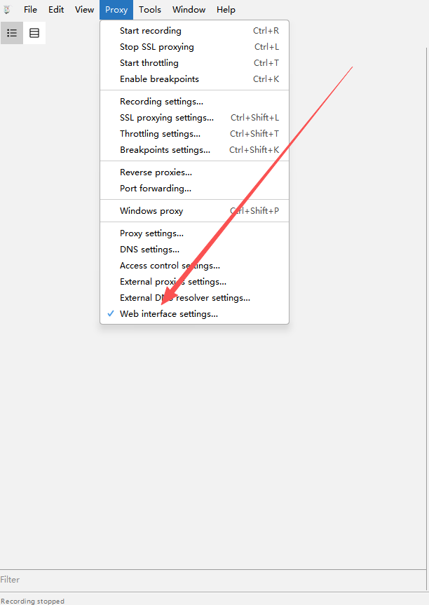
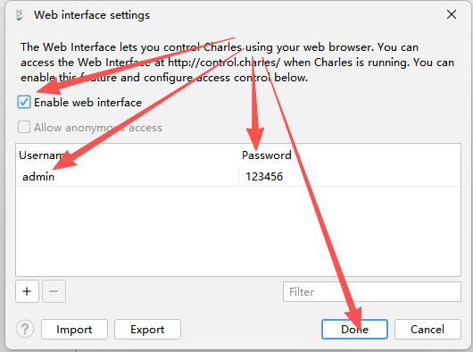

# Charles MCP Server

[](https://pypi.org/project/charles-mcp/)
[](LICENSE)
[](https://pypi.org/project/charles-mcp/)

[Документація](docs/README.uk.md) | [Встановлення для команди](docs/team-installation.uk.md) | [Посібник для агентів](docs/agent-guide.uk.md) | [Мапінг і перезапуск Charles](docs/charles-mapping.uk.md) | [ADR-0001](docs/adr/0001-data-driven-body-aware-mocks.uk.md) | [Контракт інструментів](docs/contracts/tools.uk.md) | [AGENTS](AGENTS.uk.md) | [Сценарії для агента](docs/agent-workflows.uk.md) | [English README](README.en.md)

Charles MCP Server підключає Charles Proxy до MCP-клієнтів. Агент може дивитися живий трафік, аналізувати збережені записи і розкривати окремі запити лише тоді, коли це справді потрібно.

Сервер розв'язує три задачі:

- читати новий трафік поточної сесії Charles, доки запис ще триває;
- вести live- і history-аналіз через структуровані дані, а не віддавати агенту сирі дампи;
- спершу видавати зведення (summary-first), щоб агент знайшов гарячі точки до того, як запитувати деталі.

## Напрям релізу (v3.0)

З `v3.0` `charles-mcp` розвивається від простого перегляду трафіку до сценаріїв реверс-інжинірингу.

- Поверх наявного live/history-аналізу додано набір reverse-інструментів: імпорт, запити, декодування, повтор (replay), пошук кандидатів у підписи і live-сесії реверс-аналізу.
- Мета — дати агенту не лише переглядати трафік, а й вибудовувати повний цикл реверс-аналізу навколо авторизації, підписів, мутації параметрів і відтворюваності запитів.

## Швидкий старт

### 1. Увімкніть Charles Web Interface

У Charles відкрийте: `Proxy -> Web Interface Settings`

Перевірте, що:

- позначено `Enable web interface`;
- ім'я користувача `admin`;
- пароль `123456`.

> Значення `admin` / `123456` використовуються за замовчуванням в усіх прикладах. Для справжньої роботи задайте свій пароль і передайте його через `CHARLES_USER` / `CHARLES_PASS`.

Де розташований пункт меню:



Вікно налаштувань:



### 2. Встановіть і налаштуйте MCP-клієнт

> **Ніколи не ставте цей форк із реєстру.** Пакет `charles-mcp` у PyPI — це upstream 3.0.3: у ньому немає інструментів моків, а без обмеження `mcp<2` він падає на старті з `ModuleNotFoundError: mcp.server.fastmcp`. Тобто `uvx charles-mcp` і `pip install charles-mcp` дають сервер без половини інструментів, причому збій ніяк не називає причини. Ставте з цього репозиторію або з офлайн-архіву — див. [docs/team-installation.uk.md](docs/team-installation.uk.md).

Оберіть один зі шляхів встановлення; усе нижче посилається на `<PATH>` — абсолютний шлях до чекауту або до розпакованого архіву.

**Шлях A — через [uv](https://docs.astral.sh/uv/getting-started/installation/):**

```bash
cd <PATH> && uv sync --locked
```

**Шлях B — офлайн, з архіву, що несе `wheels/`:** потрібен лише Python.

```bash
cd <PATH>
python3 -m venv .venv
.venv/bin/pip install --no-index --find-links wheels -r requirements-lock.txt
```

У `CHARLES_USER` / `CHARLES_PASS` нижче підставте свої дані від Charles Web Interface; наведені значення — заглушки.

#### Claude Code CLI

```bash
claude mcp add-json charles '{
  "type": "stdio",
  "command": "uv",
  "args": ["run", "--project", "<PATH>", "charles-mcp"],
  "env": {
    "CHARLES_USER": "ваш-логін",
    "CHARLES_PASS": "ваш-пароль",
    "CHARLES_MANAGE_LIFECYCLE": "false"
  }
}'
```

#### Claude Desktop / Cursor / Kiro / загальний JSON-конфіг

```json
{
  "mcpServers": {
    "charles": {
      "command": "uv",
      "args": ["run", "--project", "<PATH>", "charles-mcp"],
      "env": {
        "CHARLES_USER": "ваш-логін",
        "CHARLES_PASS": "ваш-пароль",
        "CHARLES_MANAGE_LIFECYCLE": "false"
      }
    }
  }
}
```

На шляху B замініть ці два рядки на інтерпретатор самого віртуального оточення:

```json
"command": "<PATH>/.venv/bin/python",
"args": ["<PATH>/charles-mcp-server.py"]
```

Kiro читає `.kiro/settings/mcp.json` у проєкті (він виграє) або `~/.kiro/settings/mcp.json` і додатково приймає `"disabled": false` та `"autoApprove": [...]`.

#### Codex CLI

```toml
[mcp_servers.charles]
command = "uv"
args = ["run", "--project", "<PATH>", "charles-mcp"]

[mcp_servers.charles.env]
CHARLES_USER = "ваш-логін"
CHARLES_PASS = "ваш-пароль"
CHARLES_MANAGE_LIFECYCLE = "false"
```

### Автовстановлення через AI-агента

Дайте агенту (Claude Code, Cursor Agent, Kiro, Gemini CLI, ChatGPT з інструментами) промпт нижче, замінивши `<PATH>` на абсолютний шлях до чекауту чи розпакованого архіву. Промпт лишено англійською: агенти виконують його однаково будь-якою мовою спілкування.

<details>
<summary><strong>Натисніть, щоб розкрити промпт автовстановлення</strong></summary>

```text
Install the charles-mcp MCP server from the local directory <PATH> and configure
my MCP client to use it. Follow these steps exactly.

CRITICAL RULE: never run `pip install charles-mcp`, `uvx charles-mcp` or
`uv tool install charles-mcp`. The name charles-mcp on PyPI is a different,
older package without the mocking tools, and it fails to start. Everything must
come from the directory above and from the wheels/ folder inside it.

Step 1 - Check the directory:
  Confirm <PATH> exists and contains pyproject.toml, charles_mcp/ and
  charles-mcp-server.py. If it does not, stop and tell me.
  Note whether it also contains wheels/ and requirements-lock.txt.

Step 2 - Build the environment, preferring the offline path:
  a) If wheels/ and requirements-lock.txt exist, use them (no network):
       cd <PATH>
       python3 -m venv .venv
       .venv/bin/pip install --no-index --find-links wheels -r requirements-lock.txt
     On Windows the interpreter is .venv\Scripts\python.exe.
     If pip reports no matching distribution, the wheels were built for other
     Python versions - report the Python version you used and stop.
  b) Otherwise, if `uv --version` works:
       cd <PATH> && uv sync --locked
  c) Otherwise tell me which of the two is missing instead of improvising.

Step 3 - Verify the server starts:
  Run it for about 3 seconds, then terminate it:
    <PATH>/.venv/bin/python <PATH>/charles-mcp-server.py
  (or `uv run --project <PATH> charles-mcp` if you took path 2b).
  It must start with no import errors. A line about default credentials is
  expected and fine.

Step 4 - Detect my MCP client, first match wins:
  a) Kiro - .kiro/settings/mcp.json in the current project, else ~/.kiro/settings/mcp.json
  b) Claude Code - `claude --version` succeeds
  c) Cursor - ~/.cursor/mcp.json or .cursor/mcp.json
  d) Claude Desktop - ~/Library/Application Support/Claude/claude_desktop_config.json
     (Windows: %APPDATA%\Claude\claude_desktop_config.json,
      Linux: ~/.config/Claude/claude_desktop_config.json)
  e) Windsurf - ~/.codeium/windsurf/mcp_config.json
  If none is found, ask me.

Step 5 - Ask me for my Charles Web Interface login and password before writing
  them anywhere. Do not invent values and do not reuse the examples from the
  documentation.

Step 6 - Write the config entry, using ABSOLUTE paths:
    "charles": {
      "command": "<PATH>/.venv/bin/python",
      "args": ["<PATH>/charles-mcp-server.py"],
      "env": {
        "CHARLES_USER": "<the login I gave you>",
        "CHARLES_PASS": "<the password I gave you>",
        "CHARLES_MANAGE_LIFECYCLE": "false"
      }
    }
  If you used uv (path 2b) instead:
      "command": "uv",
      "args": ["run", "--project", "<PATH>", "charles-mcp"]

  Read any existing config file first, parse the JSON, add "charles" inside
  "mcpServers" (create "mcpServers" if absent) and write it back. Do not drop or
  overwrite other servers. Kiro also accepts "disabled": false and "autoApprove";
  if you set autoApprove, list only read-only tools: charles_status,
  start_live_capture, query_live_capture_entries, group_capture_analysis. Never
  auto-approve reset_environment, mock_setup_host, mock_route_setup or
  reverse_replay_entry - they close Charles, write its config, or send real
  requests to real servers.

Step 7 - Report which client you configured and which config file you edited,
  and tell me to restart that client. For Kiro, saving mcp.json reconnects the
  server - it should appear in the MCP panel. Remind me that Charles must be
  running with its Web Interface enabled (Proxy -> Web Interface Settings).
```

</details>

## Вимоги

- Python 3.10+
- запущений локально Charles Proxy
- увімкнений Charles Web Interface
- проксі Charles слухає `127.0.0.1:8888`

Рекомендоване значення за замовчуванням — `CHARLES_MANAGE_LIFECYCLE=false`. Не дозволяйте MCP-серверу закривати ваш Charles, якщо ви явно не хочете, щоб він керував запуском і зупинкою Charles.

## Змінні оточення

| Змінна | За замовчуванням | Призначення |
| --- | --- | --- |
| `CHARLES_USER` | `admin` | Ім'я користувача Charles Web Interface |
| `CHARLES_PASS` | `123456` | Пароль Charles Web Interface |
| `CHARLES_PROXY_HOST` | `127.0.0.1` | Хост проксі Charles |
| `CHARLES_PROXY_PORT` | `8888` | Порт проксі Charles |
| `CHARLES_CONFIG_PATH` | автовизначення | Шлях до файлу конфігурації Charles |
| `CHARLES_REQUEST_TIMEOUT` | `10` | Тайм-аут HTTP-запитів до Charles у секундах |
| `CHARLES_MANAGE_LIFECYCLE` | `false` | Чи має MCP-сервер запускати і зупиняти Charles |
| `CHARLES_REVERSE_STATE_DIR` | `${CHARLES_STATE_DIR}/reverse` | Каталог стану reverse-аналізу: артефакти і база SQLite |
| `CHARLES_MOCK_DIR` | `~/charles-mocks` | Корінь сховища моків Map Local; Charles мапить `https://<host>/*` у `<CHARLES_MOCK_DIR>/<host>/`. Правила диспетчера лежать у `<CHARLES_MOCK_DIR>/_rules/` |
| `CHARLES_DISPATCHER_PORT` | `18080` | Порт локального диспетчера, на який указують правила Map Remote |
| `CHARLES_DISPATCHER_TIMEOUT` | `20` | Тайм-аут у секундах для запитів, які диспетчер пересилає на сервер |

## Рекомендовані сценарії

### Live-аналіз

1. `start_live_capture`
2. `group_capture_analysis`
3. `query_live_capture_entries`
4. `get_traffic_entry_detail`
5. `stop_live_capture`

Цей шлях дозволяє спершу знайти гарячі точки з мінімальною витратою токенів, а потім розкрити один підтверджений запит.

### Аналіз історії

1. `list_recordings`
2. `analyze_recorded_traffic`
3. `group_capture_analysis(source="history")`
4. `get_traffic_entry_detail`

Цей шлях підходить, щоб переглянути збережені записи і потім заглибитися в обрані запити.

### Підміна відповідей через Map Local

> Як влаштовані правила в Charles, коли і як Charles перезапускається, відкат і діагностика — у [docs/charles-mapping.uk.md](docs/charles-mapping.uk.md).

1. `mock_setup_host` — один раз на хост: створює `<CHARLES_MOCK_DIR>/<host>/` і правила Charles. З `apply=true` (Charles має бути закритий) записує їх у конфіг Charles, інакше повертає інструкцію для ручного налаштування.
2. `start_live_capture` + `query_live_capture_entries` — знайти справжню відповідь.
3. `mock_create_from_entry` з правками `patches` у форматі JSON Pointer (або `mock_write`, щоб написати відповідь з нуля).
4. Застосунок повторює запит; перевірте результат через `query_live_capture_entries(response_header_name="X-Charles-Map-Local")`.
5. `mock_remove` — повернутися до справжнього сервера (файл іде в архів, а не видаляється); `mock_set_enabled(false)` — призупинити всі моки.

Мок — це просто файл за шляхом `<CHARLES_MOCK_DIR>/<host>/<шлях запиту>`. Доки файл існує, Charles віддає його і перечитує на кожен запит; якщо файлу немає, запит іде на справжній сервер.

Обмеження Map Local:

- статус відповіді завжди 200;
- query string і HTTP-метод ігноруються, тому всі варіанти одного шляху отримують той самий файл;
- `/users` і `/users/42` не можна замокати одночасно: `users` не може бути водночас файлом і каталогом.

Налаштування також додає правило Rewrite, яке віддає моки як `application/json`: Charles позначає файли без розширення як `text/plain`.

### Багато шляхів і action: правила диспетчера

Використовуйте для справжнього API: багато шляхів, POST-запити, де операцію обирає поле `action`, і те саме API на кількох хостах (dev, stage тощо). Map Local такі запити не розрізняє, диспетчер розрізняє. Обґрунтування — в [ADR-0001](docs/adr/0001-data-driven-body-aware-mocks.uk.md).

> Правило в Charles ставиться один раз на домен і потребує перезапуску Charles (або ручного введення в UI без перезапуску). Інструменти самі Charles не закривають і не запускають: порядок дій, що втрачається і як відкотити — у [docs/charles-mapping.uk.md](docs/charles-mapping.uk.md).

**Один раз на домен.** `mock_route_setup(host="*.example.com", path="/api/*")` заводить маршрут і повертає одне правило Map Remote для Charles: `https://*.example.com/api/*` → локальний диспетчер із порожнім шляхом призначення (Charles зберігає вихідний шлях) і ввімкненим «Preserve host header». `apply=true` записує його, доки Charles закритий. Після цього всі шляхи, action і хости під маршрутом — лише дані, а запити без правила йдуть на справжній сервер без змін.

**На кожну сесію.**

1. `start_live_capture`, потім пройдіть сценарій у застосунку.
2. `mock_discover_variants(source="live", capture_id)` показує всю сесію: метод × хост × шлях × значення `action` (`null` для GET) з кількістю, прикладами `entry_id` і статусами. Фільтри — `host_contains` / `path_contains`.
3. На кожну правку, яку просить користувач: `mock_rule_create_from_entry(entry_id, match_body_fields=["/action"], response_patches=[...], request_patches=[...])`.
   - `mode="patch"` (за замовчуванням): відповідає справжній сервер, змінюються лише вказані поля запиту й відповіді.
   - `mode="fixture"`: знята відповідь із правками і будь-яким `status`, наприклад 500, без звернення до сервера.
   - `status` підміняє код відповіді, `delay_ms` затримує її (0–60000 мс) — для перевірки лоадерів і тайм-аутів, `request_headers` задає або видаляє заголовки запиту перед відправкою.
   - Сегменти шляху, що залежать від платформи чи версії застосунку, замінюйте на `*` через `match_path`, наприклад `/api/*/payoneer`.
   - За замовчуванням правило діє на всіх хостах маршруту (`host_scope="any"`); `host_scope="exact"` або `host="stage.example.com"` звужують його, і правило для конкретного хоста перемагає загальне.
   - Повторне прохання для того самого варіанта доповнює його правило (`merge=true`); правка того самого поля замінює попередню.
4. `mock_dispatcher(action="start")`, потім повторіть дії в застосунку.
5. Перевірте через `query_live_capture_entries(response_header_name="X-Charles-MCP-Rule")`: у заголовку id правила або `passthrough`.

Зберігання в `<CHARLES_MOCK_DIR>/_rules/`: `routes.json` (маршрути), `_any/` (правила для будь-якого хоста або шаблону хоста), `<host>/` (правила для одного хоста), фікстури поруч із правилами як `<rule_id>.body`. Диспетчер перечитує їх на кожен запит, тому правки діють одразу. Він пересилає лише запити, покриті маршрутом, слухає `127.0.0.1` і має працювати, доки в Charles увімкнене правило Map Remote; для постійної роботи є команда `charles-mcp-dispatcher`. Маршрут на весь хост (`/*`) пропускає через диспетчер і статику, і WebSocket: завантаження буферизуються, а WebSocket не підтримується, тому краще вказувати префікс API.

> ⚠️ Фікстури — це зняті справжні відповіді, у них можуть бути персональні та платіжні дані. Тримайте `CHARLES_MOCK_DIR` поза репозиторіями і нікому не пересилайте; діліться описами правил із синтетичними даними.

## Основні зміни версії (v3.0.3)

- Точки входу в документацію зведені до `docs/README.md`.
- Додані документи для агентів: `AGENTS.md` у корені та `docs/agent-workflows.md` зі сценаріями за задачами.
- У README і `docs/contracts/tools.md` додані посилання на документи для агентів зі шляхами відносно репозиторію.
- В описи часто вживаних інструментів додані мінімально потрібні підказки (збереження ідентичності джерела, summary-first, різниця між peek і read), а контрактні тести не дають їм розходитися з документацією.
- Напрям продукту явно включає реверс-інжиніринг: доступні reverse-інструменти для імпорту, декодування, повтору запитів, пошуку кандидатів у підписи і live-сценаріїв реверс-аналізу.
- `read_live_capture` і `peek_live_capture` тепер повертають лише короткі поля маршруту (`host`, `method`, `path`, `status`) замість сирих записів Charles. Так частий опит не переповнює контекстне вікно.
- `query_live_capture_entries` став інструментом лише для читання і не зсуває live-курсор. Той самий `capture_id` можна перевикористовувати з різними фільтрами, не «з'їдаючи» накопичений приріст.
- Зведення `analyze_recorded_traffic` і `query_live_capture_entries` повертають `matched_fields` і `match_reasons`, щоб агент міг пояснити, чому обрано запит.
- У `get_traffic_entry_detail` за замовчуванням `include_full_body=false` і `max_body_chars=2048`. Якщо оцінний розмір відповіді перевищує приблизно 12 000 символів, інструмент додає попередження з порадою звузити запит.
- Зведення і деталі автоматично прибирають значення `null` і приховують внутрішні поля `header_map`, `parsed_json`, `parsed_form`, `lower_name`. Заголовки беріть зі списку `headers`.

## Каталог інструментів

Цей README описує весь публічний набір інструментів.

### Інструменти live-захоплення

| Інструмент | Що робить | Коли використовувати |
| --- | --- | --- |
| `start_live_capture` | Запускає або підхоплює поточне live-захоплення і повертає `capture_id`; за замовчуванням `adopt_existing=true`, `reset_session=false`, **не очищає** вже записаний трафік Charles і **завжди включає його** в захоплення | Перед початком спостереження в реальному часі |
| `read_live_capture` | Читає нові записи за курсором і повертає лише короткі зведення маршрутів | Для безперервного читання нового трафіку, коли спершу потрібні лише host/path/status |
| `peek_live_capture` | Показує нові записи без зсуву курсора, лише короткі зведення маршрутів | Щоб зазирнути в новий трафік, не змінюючи позицію читання |
| `stop_live_capture` | Зупиняє захоплення і за потреби зберігає знімок | Під час завершення або експорту live-сесії |
| `query_live_capture_entries` | Видає структуроване зведення по live-захопленню без зсуву курсора; `since_seconds=N` обмежує трафік останніми N секундами | Для багаторазової фільтрації важливих запитів із поточного трафіку |

### Інструменти аналізу

| Інструмент | Що робить | Коли використовувати |
| --- | --- | --- |
| `group_capture_analysis` | Групує live- або history-трафік за ключем | Коли потрібен найощадливіший за токенами огляд гарячих точок |
| `get_capture_analysis_stats` | Повертає грубу статистику за класами трафіку | Щоб швидко побачити розподіл: API, статика, помилки |
| `get_traffic_entry_detail` | Завантажує деталі одного запису і попереджає про завелику відповідь | Коли `entry_id` цілі вже відомий |
| `analyze_recorded_traffic` | Видає структуроване зведення за збереженим записом із причинами збігу | Для аналізу знімка `.chlsj` |

### Інструменти історії

| Інструмент | Що робить | Коли використовувати |
| --- | --- | --- |
| `list_recordings` | Показує збережені файли записів | Перед вибором історичного знімка |
| `get_recording_snapshot` | Завантажує сирий вміст одного збереженого запису | Коли потрібен сам збережений знімок |
| `query_recorded_traffic` | Легка фільтрація останнього збереженого запису | Для швидкого пошуку за host, методом або регулярним виразом |

### Інструменти стану і керування

| Інструмент | Що робить | Коли використовувати |
| --- | --- | --- |
| `charles_status` | Показує зв'язок з Charles і стан активного захоплення; поле `recommended_next_action` підказує наступний крок | Щоб перевірити, чи доступний Charles і чи активне захоплення |
| `throttling` | Вмикає пресет сповільнення мережі в Charles | Для емуляції 3G, 4G, 5G або вимкнення сповільнення |
| `reset_environment` | Відновлює конфігурацію Charles і очищає поточне оточення | Коли треба повернутися до чистого стану |

> ⚠️ `reset_environment` закриває Charles, перезаписує його конфіг із бекапа і видаляє каталог збережених записів. Викликайте його лише свідомо.

### Інструменти реверс-аналізу

| Інструмент | Що робить | Коли використовувати |
| --- | --- | --- |
| `reverse_import_session` | Імпортує офіційну XML- або нативну сесію Charles у канонічне reverse-сховище | Щоб почати replay, декодування або аналіз підписів зі збережених експортів |
| `reverse_list_captures` | Показує імпортовані reverse-захоплення | Щоб обрати захоплення, яке вже лежить у reverse-SQLite |
| `reverse_query_entries` | Фільтрує імпортовані reverse-записи за полями маршруту | Щоб звузити набір кандидатів перед детальним переглядом або replay |
| `reverse_get_entry_detail` | Повертає канонічну деталізацію одного імпортованого запису | Для глибокого розбору одного базового запиту |
| `reverse_decode_entry_body` | Декодує збережене тіло запиту або відповіді, включно з protobuf за дескриптором | Коли треба зрозуміти структуру payload |
| `reverse_replay_entry` | Повторює один імпортований запит з необов'язковими мутаціями | Щоб перевірити, чи відтворюється запит і як він реагує на зміни |
| `reverse_discover_signature_candidates` | Порівнює кілька імпортованих записів і ранжує поля, схожі на підпис | Для пошуку динамічних параметрів авторизації або підпису |
| `reverse_list_findings` | Показує збережені результати replay і аналізу підписів | Щоб переглянути вже зібрані докази |
| `reverse_charles_recording_status` | Показує стан запису Charles і reverse live-сесії | Щоб перевірити готовність до live-реверс-аналізу |
| `reverse_start_live_analysis` | Запускає reverse live-сесію і знімає сесію Charles через офіційні сторінки експорту | Коли реверс-аналіз має стежити за свіжим трафіком |
| `reverse_peek_live_entries` | Читає нові reverse live-записи без зсуву курсора | Щоб подивитися новий трафік до його обробки |
| `reverse_read_live_entries` | Читає нові reverse live-записи і зсуває курсор | Щоб просунути reverse live-аналіз |
| `reverse_stop_live_analysis` | Зупиняє reverse live-сесію і за потреби відновлює запис | Для акуратного завершення reverse live-сесії |
| `reverse_analyze_live_login_flow` | Оцінює новий трафік на зв'язок із логіном і авторизацією та пропонує наступні кроки | Для розбору логіна, отримання токена, встановлення сесії |
| `reverse_analyze_live_api_flow` | Оцінює новий трафік як API-ланцюжок і пропонує наступні кроки | Для розбору ланцюжків бізнес-API |
| `reverse_analyze_live_signature_flow` | Фокусується на запитах, чутливих до підпису, і планує експерименти з мутаціями | Для розбору захистів на sign, nonce, timestamp |

### Інструменти моків Map Local

| Інструмент | Що робить | Коли використовувати |
| --- | --- | --- |
| `mock_setup_host` | Створює каталог моків для хоста і правила Map Local + Rewrite (інструкція для ручного налаштування або запис у конфіг з `apply=true`, доки Charles закритий) | Один раз на кожен API-хост |
| `mock_create_from_entry` | Перетворює захоплену відповідь на мок, застосовуючи правки JSON Pointer | Коли користувач хоче змінити дані, які отримав застосунок |
| `mock_write` | Пише мок із JSON-значення або сирого тексту | Коли справжньої відповіді ще немає |
| `mock_list` / `mock_get` | Список активних моків / вміст одного | Щоб подивитися, що зараз підміняється |
| `mock_remove` | Відправляє мок в архів, шлях знову йде на справжній сервер | Коли сценарій завершено |
| `mock_set_enabled` | Вмикає або вимикає весь Map Local через Web Interface | Щоб призупинити або відновити всі моки |

### Інструменти правил диспетчера

| Інструмент | Що робить | Коли використовувати |
| --- | --- | --- |
| `mock_route_setup` | Спрямовує хост або шаблон домену (за замовчуванням усі шляхи) через диспетчер і повертає одне правило Map Remote (з `apply=true` при закритому Charles записує його в конфіг) | Один раз на домен |
| `mock_discover_variants` | Групує всю сесію за методом, хостом, шляхом і полем тіла, наприклад `/action` | Одразу після читання сесії |
| `mock_rule_create_from_entry` | Створює або доповнює правило одного варіанта (метод + шлях + значення тіла/query): режим patch або fixture, будь-який статус, затримка, правка заголовків запиту, за замовчуванням на будь-якому хості | На кожну правку, яку назвав користувач |
| `mock_rule_write` | Пише документ правила напряму, за бажанням із фікстурою | Коли знятого запиту немає |
| `mock_rule_list` / `mock_rule_get` | Список маршрутів і правил / одне правило з фікстурою | Щоб подивитися, що замокано |
| `mock_rule_set_enabled` / `mock_rule_remove` | Призупинити правило / відправити в архів | Коли сценарій завершено |
| `mock_dispatcher` | Запускає, зупиняє або перевіряє локальний диспетчер; start/stop заразом вмикають і вимикають Map Remote у Charles, щоб трафік не впирався в зупинений диспетчер | Перед тестом і після |

## Ключова поведінка

### 1. За замовчуванням повертаються сирі дані

Ця версія більше не маскує вміст запитів і відповідей:

- зведення, деталі, live і history повертають сирі значення;
- якщо потрібне маскування, його має робити MCP-клієнт або агент.

> ⚠️ Токени, cookie і персональні дані з трафіку потрапляють у контекст моделі як є. Використовуйте тестові акаунти і стенди.

### 2. Спочатку зведення, потім деталі

Спершу викликайте `group_capture_analysis`, `query_live_capture_entries` або `analyze_recorded_traffic`, і лише для підтвердженої цілі — `get_traffic_entry_detail`.

Не вмикайте `include_full_body=true` без явної причини.

### 3. Вивід оптимізований під бюджет токенів

Серіалізація всіх зведень і деталей полегшена:

- внутрішні поля `header_map`, `parsed_json`, `parsed_form`, `lower_name` не потрапляють у вивід інструментів;
- значення `null` автоматично прибираються під час серіалізації;
- якщо в детальному вигляді є `full_text`, надлишковий `preview_text` видаляється.

Значення за замовчуванням зменшені, щоб берегти контекстне вікно:

| Параметр | Старе значення | Нове значення |
| --- | --- | --- |
| `max_items` | 20 | 10 |
| `max_preview_chars` | 256 | 128 |
| `max_headers_per_side` | 8 | 6 |
| `max_body_chars` | 4096 | 2048 |

Якщо потрібен ширший огляд, більші значення так само можна передати явно.

### 4. Деталі з історії потребують стабільного ідентифікатора джерела

Зведення по історії повертають `recording_path`, зведення по live — `capture_id`.

Для `get_traffic_entry_detail`:

- в історії передавайте `recording_path`;
- у live передавайте `capture_id`.

### 5. Збій `stop_live_capture` відновлюваний

У `stop_live_capture` два стабільні кінцеві стани:

- `status="stopped"` — захоплення справді закрите;
- `status="stop_failed"` — короткий повтор теж не вдався, але захоплення збережене.

Якщо результат такий:

```json
{
  "status": "stop_failed",
  "recoverable": true,
  "active_capture_preserved": true
}
```

означає, що захоплення так само можна читати, діагностувати і згодом зупинити повторно.

## Розробка

CI пропускає зміни лише після успішного проходження ruff, mypy і pytest. Локально запускайте те саме:

```bash
python -m ruff check charles_mcp tests
python -m mypy charles_mcp
python -m pytest -q
```

Корисні команди для локального запуску:

```bash
python charles-mcp-server.py
python -c "from charles_mcp.main import main; main()"
```

## Див. також

- [Документація](docs/README.uk.md)
- [Як це працює: схеми та налаштування Kiro](docs/how-it-works.uk.html)
- [English README](README.en.md)
- [Контракт інструментів](docs/contracts/tools.uk.md)
